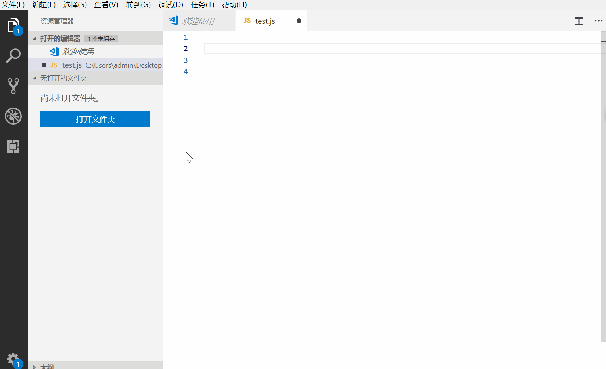
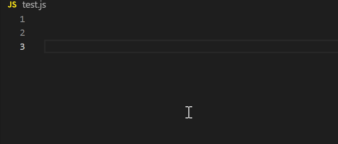
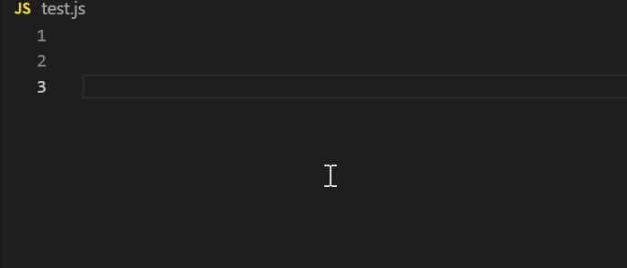
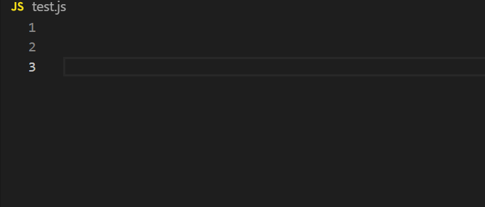
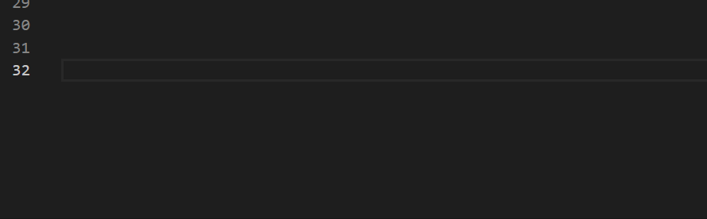

# CODE-BLAST

> Particles blasts while typing in vscode with this extension(base on [code-blast-codemirror](https://github.com/chinchang/code-blast-codemirror)).
>
> 本插件能让你在vscode敲代码时出现爆破粒子的效果
>
> Github:[https://github.com/fanxq/code-blast-for-vscode](https://github.com/fanxq/code-blast-for-vscode) 

## Features

### Particles effects

## Extension Settings

> configuration of this extension 该插件提供以下的设置
* `codeBlast.enable`: 启用/禁用插件
* `codeBlast.shake.enabled`: 启用/禁用shake效果
* `codeBlast.particles.color`: 设置粒子的颜色
* `codeBlast.particles.shape`: 设置粒子的形状

## Known Issues

> this extension will modify some vscode files,so there may be exists some issues
>
> 该插件在运行时会修改vscode的文件，因此可能会有以下问题

    1. it seems no work after installing the extension. make sure that you have the administrator authority and open vscode with the administrator authority
       插件安装后却不起作用，敲代码时没有效果,请确保你有管理员权限，并以管理员权限打开vscode

    2.if vscode complains about that it is corrupted after installing this extension,just simply click “Don't show again”
      插件安装后出现"vscode安装似乎损坏"的提示消息，选择【不再显示】即可
    
    3.set 'codeBlast.enable' to false in Settings before uninstalling the extension
      因为该插件修改了vscode的文件，直接卸载插件无法将修改的文件还原，因此卸载该插件时，请先在设置中将‘codeBlast.enable’设置为false。

**Enjoy!**